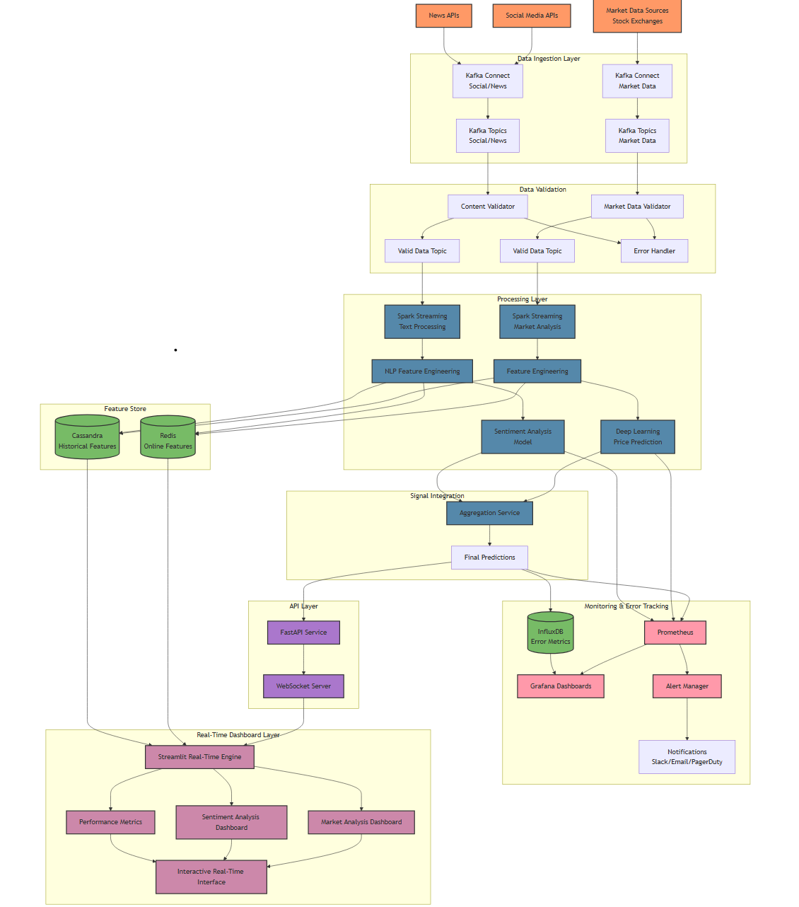

# MarketPulseAI: Real-Time Stock Market Analysis System

[](https://opensource.org/licenses/MIT)
[](http://makeapullrequest.com)


For the past few months, I've been dedicating my nights and weekends to a side project that combines my passions for machine learning and financial markets. As an ML/AI engineer by day, I wanted to challenge myself with something that would push my technical boundaries.


## 🔍 What Does MarketPulseAI Do?

MarketPulseAI is an open-source, near real-time stock market analysis system that combines two powerful perspectives:

1. **Stock Market Prediction** using price data and deep learning algorithms
2. **Market Sentiment Analysis** from social media and financial news

Think of it as having two eyes on the market: one watching actual prices and trading patterns, and another watching what people are saying about stocks on social media and in the news. The system then integrates these signals to provide a holistic view of potential market movements.

## 🚀 Key Features

- **Microservices Architecture**: Modular design with loosely coupled services
- **Near Real-Time Processing**: Data flows through the system with minimal latency
- **Dual Analysis Approach**: Combines price prediction with sentiment analysis
- **Comprehensive Data Validation**: Ensures high-quality data reaches prediction models
- **Interactive Dashboards**: Real-time visualization of market data and sentiment
- **Robust Monitoring**: Complete observability of system health and prediction accuracy

## 🏗️ System Architecture

MarketPulseAI follows a modern data engineering pattern with clear separation of concerns:

<p align="center">
  
</p>


### Data Ingestion Layer

- **Market Data Pipeline**
  - Connects to stock market feeds via Kafka Connect
  - Collects real-time price data, volumes, and market indicators
  - Validates and routes data to appropriate Kafka topics

- **Sentiment Analysis Pipeline**
  - Monitors Twitter, Reddit, and financial news via APIs
  - Collects and filters relevant posts and articles
  - Validates content before processing

### Processing Layer

- **Market Data Analysis**
  - Spark Streaming jobs process real-time market data
  - Feature engineering extracts technical indicators
  - Deep learning models predict short-term price movements

- **Sentiment Analysis**
  - Text preprocessing and cleaning
  - NLP or Transformer models determine sentiment polarity and intensity
  - Aggregation of sentiment across different sources

### Feature Store

- **Online Features** (Redis)
  - Low-latency access to real-time features
  - Optimized caching with custom serialization
  - Configurable TTL for data freshness

- **Historical Features** (Cassandra)
  - Distributed storage for training data
  - Time-series optimized schema
  - Efficient querying for model training

### Signal Integration

- Combines predictions from market and sentiment models
- Weighted ensemble approach for final predictions
- Continuous evaluation and re-weighting based on performance

### API and Dashboard

- FastAPI service with WebSocket support
- Streamlit dashboards for interactive visualization
- Real-time updates of predictions and sentiment scores

### Monitoring & Observability

- Prometheus metrics collection
- Grafana dashboards for system visualization
- InfluxDB for time-series performance metrics
- Alerting system for anomaly detection

## 💻 Technology Stack

| Component | Technologies |
|-----------|-------------|
| **Data Ingestion** | Apache Kafka, Kafka Connect |
| **Processing** | Apache Spark Streaming |
| **Storage** | Redis, Apache Cassandra |
| **ML & Analytics** | PyTorch, TensorFlow, spaCy, NLTK |
| **API & Serving** | FastAPI, WebSockets |
| **Visualization** | Streamlit, Plotly |
| **Deployment** | Docker, Kubernetes |
| **Monitoring** | Prometheus, Grafana, InfluxDB |

## 🤔 Why I Built It This Way
I wanted to challenge myself with an ambitious, end-to-end application that would push my limits across multiple domains. Here's my thinking behind the approach:

• **Comprehensive Learning**: Building everything from data ingestion to visualization gave me a holistic view of the entire ML pipeline in production

• **Technical Depth**: I dove deep into configuring each technology - tuning Kafka partitioning for optimal throughput, optimizing Spark executor memory allocation, and implementing custom serialization for Redis caching

• **New Territories**: This project pushed me to explore technologies I rarely use, particularly in platform monitoring and observability (Prometheus metric collection, Grafana dashboard configuration, and alert management)

• **Open Source First**: I committed to using open-source technologies throughout the stack to keep the project accessible and modifiable

• **Local to Cloud Path**: I designed everything to run locally first with Docker Compose, with a clear migration path to cloud services once the fundamentals are solid

• **Community Driven**: After countless discussions with data engineers and professionals on Reddit and Discord, I incorporated many of their suggestions and best practices

• **Practical Approach**: I deliberately chose near real-time processing over true streaming (no Apache Flink) because it provides an excellent balance between performance and complexity for this use case

• **Proof of Concept**: I wanted to demonstrate that even smaller companies can implement sophisticated data pipelines without massive infrastructure investments

• **Skill Stretching**: If I can successfully push ML into production for real-time analysis, other ML deployment scenarios will become significantly easier by comparison

• **Finance Education**: This project doubled as an incredible learning journey into financial markets, technical analysis, and trading psychology

The most fascinating discovery has been seeing how social sentiment sometimes predicts price movements before they appear in market data!

## 🔮 Roadmap

- [ ] Add more data sources (options flow, institutional trading patterns)
- [ ] Implement transformer-based models for better time-series forecasting
- [ ] Add support for cryptocurrency markets
- [ ] Improve Transformer models for more nuanced sentiment analysis
- [ ] Optimize performance across the entire pipeline
- [ ] Add cloud deployment templates (AWS, GCP, Azure)
- [ ] Add user authentication and multi-user support

## 🤝 Contributing

Contributions are welcome! Please feel free to submit a Pull Request.

1. Fork the repository
2. Create your feature branch (`git checkout -b feature/amazing-feature`)
3. Commit your changes (`git commit -m 'Add some amazing feature'`)
4. Push to the branch (`git push origin feature/amazing-feature`)
5. Open a Pull Request

## 📋 Project Structure
At the end, the project should look like this:
```
MarketPulseAI/
│
├── .env                          # Environment variables (gitignored)
├── .gitignore                    # Git ignore rules
├── README.md                     # Project documentation
├── requirements.txt              # Python dependencies
├── docker-compose.yml            # Docker services configuration
├── Makefile                      # Common commands for development
│
├── config/                       # Configuration files
│   ├── kafka/                    # Kafka configuration
│   ├── spark/                    # Spark configuration
│   ├── redis/                    # Redis configuration
│   ├── database/                 # Database schema and migrations
│   └── logging/                  # Logging configuration
│
├── data/                         # Data storage (gitignored)
│   ├── raw/                      # Raw data from APIs
│   ├── processed/                # Processed data
│   ├── models/                   # Saved ML models
│   └── cache/                    # Cached data
│
├── notebooks/                    # Jupyter notebooks for experimentation
│   ├── market_data_exploration/  # Market data analysis
│   ├── sentiment_analysis/       # Sentiment analysis exploration
│   ├── model_development/        # ML model development
│   └── visualization/            # Visualization experiments
│
├── docs/                         # Documentation
│   ├── architecture/             # System architecture docs
│   ├── api/                      # API documentation
│   ├── user_guide/               # User documentation
│   └── development/              # Development guidelines
│
├── scripts/                      # Utility scripts
│   ├── setup/                    # Setup scripts
│   ├── data_collection/          # Data collection scripts
│   ├── backup/                   # Backup scripts
│   └── maintenance/              # Maintenance scripts
│
├── tests/                        # Test suite
│   ├── unit/                     # Unit tests
│   │   ├── market_data/          # Market data tests
│   │   ├── sentiment/            # Sentiment analysis tests
│   │   ├── prediction/           # Prediction engine tests
│   │   └── api/                  # API tests
│   ├── integration/              # Integration tests
│   ├── performance/              # Performance tests
│   └── fixtures/                 # Test fixtures
│
├── monitoring/                   # System monitoring
│   ├── health_checks/            # Health check scripts
│   ├── metrics/                  # Metrics collection
│   ├── alerts/                   # Alert configuration
│   └── dashboards/               # Monitoring dashboards
│
├── src/                          # Source code
│   ├── data_collection/          # Data collection modules
│   │   ├── __init__.py
│   │   ├── market_data/          # Market data collection
│   │   │   ├── __init__.py
│   │   │   ├── collectors/       # Data source collectors
│   │   │   ├── parsers/          # Data parsers
│   │   │   └── validation/       # Data validation
│   │   │
│   │   └── social_media/         # Social media collection
│   │       ├── __init__.py
│   │       ├── twitter/          # Twitter data collection
│   │       ├── reddit/           # Reddit data collection
│   │       └── news/             # Financial news collection
│   │
│   ├── data_processing/          # Data processing modules
│   │   ├── __init__.py
│   │   ├── market_data/          # Market data processing
│   │   │   ├── __init__.py
│   │   │   ├── cleaning/         # Data cleaning
│   │   │   ├── feature_eng/      # Feature engineering
│   │   │   └── indicators/       # Technical indicators
│   │   │
│   │   └── sentiment/            # Sentiment processing
│   │       ├── __init__.py
│   │       ├── preprocessing/    # Text preprocessing
│   │       ├── analysis/         # Sentiment analysis
│   │       └── aggregation/      # Sentiment aggregation
│   │
│   ├── storage/                  # Data storage modules
│   │   ├── __init__.py
│   │   ├── database/             # Database operations
│   │   ├── streaming/            # Streaming data handlers
│   │   ├── cache/                # Caching operations
│   │   └── models/               # Model storage
│   │
│   ├── models/                   # Machine learning models
│   │   ├── __init__.py
│   │   ├── market_prediction/    # Price prediction models
│   │   │   ├── __init__.py
│   │   │   ├── feature_selection/# Feature selection
│   │   │   ├── training/         # Model training
│   │   │   ├── evaluation/       # Model evaluation
│   │   │   └── prediction/       # Prediction generation
│   │   │
│   │   ├── sentiment_models/     # Sentiment models
│   │   │   ├── __init__.py
│   │   │   ├── classification/   # Sentiment classification
│   │   │   └── evaluation/       # Sentiment model evaluation
│   │   │
│   │   └── combined_models/      # Combined prediction models
│   │       ├── __init__.py
│   │       ├── feature_fusion/   # Feature combination
│   │       └── ensemble/         # Ensemble models
│   │
│   ├── streaming/                # Streaming data processing
│   │   ├── __init__.py
│   │   ├── kafka/                # Kafka producers/consumers
│   │   └── spark/                # Spark streaming jobs
│   │
│   ├── prediction_engine/        # Prediction engine
│   │   ├── __init__.py
│   │   ├── scheduler/            # Prediction scheduling
│   │   ├── executor/             # Prediction execution
│   │   └── evaluation/           # Real-time evaluation
│   │
│   ├── api/                      # API layer
│   │   ├── __init__.py
│   │   ├── routes/               # API routes
│   │   ├── serializers/          # Data serializers
│   │   ├── auth/                 # Authentication
│   │   └── middleware/           # API middleware
│   │
│   ├── dashboard/                # Web dashboard
│   │   ├── backend/              # Dashboard backend
│   │   │   ├── __init__.py
│   │   │   ├── server.py         # Web server
│   │   │   └── websockets/       # WebSocket handlers
│   │   │
│   │   └── frontend/             # Dashboard frontend
│   │       ├── public/           # Public assets
│   │       ├── src/              # Frontend source code
│   │       │   ├── components/   # UI components
│   │       │   ├── pages/        # Page components
│   │       │   ├── services/     # API services
│   │       │   ├── hooks/        # Custom hooks
│   │       │   ├── utils/        # Utility functions
│   │       │   └── App.js        # Main app component
│   │       │
│   │       ├── package.json      # Frontend dependencies
│   │       └── README.md         # Frontend documentation
│   │
│   ├── utils/                    # Utility modules
│   │   ├── __init__.py
│   │   ├── logging/              # Logging utilities
│   │   ├── config/               # Configuration utilities
│   │   ├── validation/           # Data validation
│   │   ├── datetime/             # Date/time utilities
│   │   └── metrics/              # Metrics utilities
│   │
│   └── alerts/                   # Alert system
│       ├── __init__.py
│       ├── triggers/             # Alert triggers
│       ├── notifications/        # Notification delivery
│       └── templates/            # Alert templates
│
└── dockerfiles/                  # Dockerfile for each service
    ├── api/                      # API service Dockerfile
    ├── data_collection/          # Data collection Dockerfile
    ├── processing/               # Processing Dockerfile
    ├── prediction/               # Prediction Dockerfile
    └── dashboard/                # Dashboard Dockerfile
```

## 📈 Performance Metrics

- Update frequency: Near real-time (seconds, not milliseconds)
- Capacity:
  - Handles millions of market data points per second
  - Processes thousands of social media posts
  - Analyzes hundreds of news articles
- Prediction latency: < 5 seconds from data ingestion to prediction
- Typical accuracy metrics: Details in [performance documentation](./docs/performance/README.md)

## ⚖️ License

This project is licensed under the MIT License - see the [LICENSE](LICENSE) file for details.

## 🙏 Acknowledgements

- [Apache Kafka](https://kafka.apache.org/)
- [Apache Spark](https://spark.apache.org/)
- [Redis](https://redis.io/)
- [Apache Cassandra](https://cassandra.apache.org/)
- [FastAPI](https://fastapi.tiangolo.com/)
- [Streamlit](https://streamlit.io/)
- [PyTorch](https://pytorch.org/)
- [TensorFlow](https://www.tensorflow.org/)
- [Docker](https://www.docker.com/)
- [Kubernetes](https://kubernetes.io/)
- [Prometheus](https://prometheus.io/)
- [Grafana](https://grafana.com/)

---

<p align="center">
  <i>If you find MarketPulseAI useful, please consider starring the repository to help others discover it!</i>
</p>